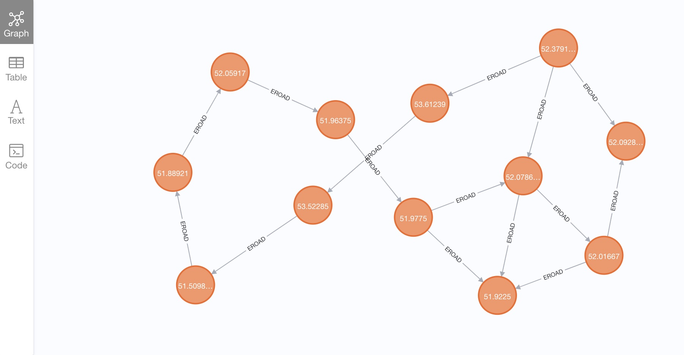

# 基于Spark和Neo4j进行图数据分析

> 基础环境基于`Hadoop`搭建，`Hadoop`是`Apache`的一个开源分布式计算平台，核心是以`HDFS`分布式文件系统和`MapReduce`分布式计算框架构成，为用户提供了一套底层透明的分布式基础设施。其中`HDFS`提供了海量数据的存储，`MapReduce`提供了对数据的计算。

使用`docker`在本地快速构建`hadoop`服务，镜像名称为`sequenceiq/hadoop-docker:latest`

```bash
> docker run -p 50070:50070 -p 9000:9000 -p 8088:8088 -it sequenceiq/hadoop-docker /etc/bootstrap.sh -bash
```
部署`Neo4j`图数据库，可以通过`docker`部署或直接从官网下载`community`社区版本。建议下载社区版，其对`apoc`和`graph algorithm`插件的支持比较好。
```bash
> docker run -d --name neo4j_db -p 7474:7474 -p 7687:7687 -v /tmp/neo4j/data:/data -v /tmp/neo4j/logs:/logs -v /tmp/neo4j/conf:/var/lib/neo4j/conf -v /tmp/neo4j/import:/var/lib/neo4j/import -v /tmp/neo4j/plugins:/plugins --env NEO4J_AUTH=neo4j/password neo4j
```
图计算平台为`apache-spark 3.0`，使用`pyspark`基于`graphframe-0.8`进行图计算。基础数据点、边表数据为`csv`文件，在代码仓库`dataset`的文件夹下，图数据导入`Neo4j`后展示如下：

`Neo4j`中的数据集主要用来演示一些图算法，如`closeness`接近中心性算法、`betweenness`中间中心性、`pageRank`等，也支持一些社区发现算法，如：`triangleCount`三角计数、`scc`强连通分量等。     