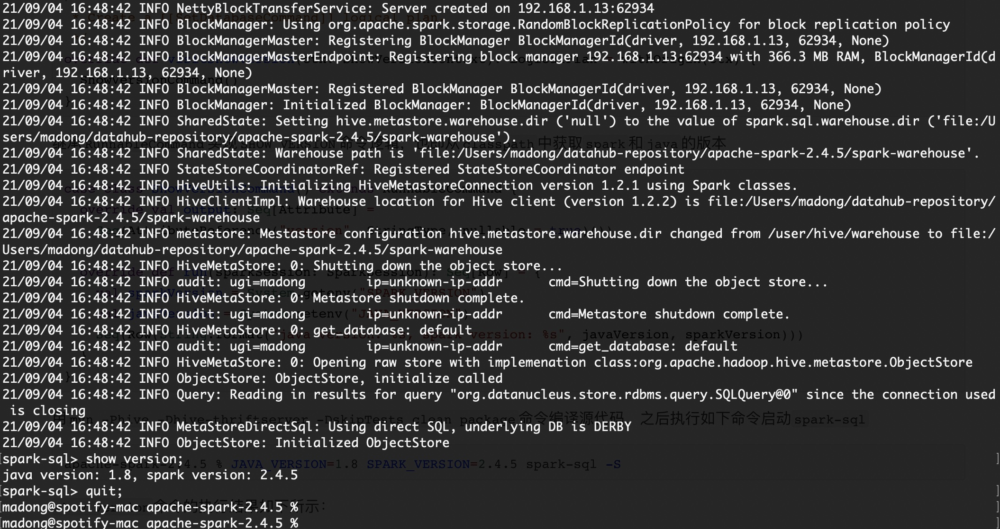

## Spark SQL
> 添加简单SQL命令到spark SQL、观察执行不同的SQL时候，引擎基于Rule规则会做哪些优化，以及如何实现自定义的优化规则。

### 1. 为Spark SQL添加一条自定义的命令，显示当前Spark版本和Java版本
```shell
spark sql> SHOW VERSION;
java version: 1.8, spark version: 2.4.5
```

是基于`spark 2.4.5`版本添加命令的，首先在`SqlBase.g4`中加入了新命令`SHOW VERSION`

```antlr
| SHOW VERSION                                                     #showVersion
// SHOW已经为关键字，将VERSION添加到`nonReserved`中
nonReserved
| VERSION
// 在SqlBase.g4最后加入`VERSION`的对应关系
VERSION: 'VERSION';
```

编译过`SqlBase.g4`后，在`SparkSqlParser(conf: SQLConf)`中实现`showVersion`方法：

```scala
/**
 * Create a [[SetDatabaseCommand]] logical plan.
 */
override def visitShowVersion(ctx: ShowVersionContext): LogicalPlan = withOrigin(ctx) {
  ShowVersionCommand()
}
```

继承`RunnableCommand`实现`SHOW VERSION`命令逻辑，也即从`classpath`中获取`spark`和`java`的版本

```scala
case class ShowVersionCommand() extends RunnableCommand {
  override val output: Seq[Attribute] =
    Seq(AttributeReference("version", StringType, nullable = true)())

  override def run(sparkSession: SparkSession): Seq[Row] = {
    val sparkVersion = System.getenv("SPARK_VERSION")
    val javaVersion = System.getenv("JAVA_VERSION")
    Seq(Row(String.format("java version: %s, spark version: %s", javaVersion, sparkVersion)))
  }
}
```

用`mvn -Phive -Dhive-thriftserver -DskipTests clean package `命令编译源代码，之后执行如下命令启动`spark-sql`：

```shell
apache-spark-2.4.5 % JAVA_VERSION=1.8 SPARK_VERSION=2.4.5 spark-sql -S
```

执行结果如下所示：


### 2. 构建SQL满足如下要求
> 在`spark-sql`中设置`set spark.sql.planChangeLog.level=WARN;`查看`SQL`的优化过程

1）构建一条SQL，同时apply下面三条优化规则：CombineFilters、CollapseProject、BooleanSimplification。

在`spark-sql`中创建一张`order`表：`create table order(id int, name varchar(50), price float)`，构建的`SQL`语句如下

```sql
spark-sql> select name, price
  from (select price, id, name from order where price > 50) a
	where a.price < 70 and 2 > 1;
```

子查询`where price > 50`和外部查询基于`price`字段过滤会应用`InferFiltersFromConstraints`规则：

```shell
=== Applying Rule org.apache.spark.sql.catalyst.optimizer.InferFiltersFromConstraints ===
 Project [name#11, price#12]
!+- Filter ((price#12 > 50.0) AND (price#12 < 70.0))
    +- HiveTableRelation [`default`.`order`, org.apache.hadoop.hive.serde2.lazy.LazySimpleSerDe, Data Cols: [id#10, name#11, price#12], Partition Cols: []]
```

而`CollapseProject`的优化规则指，当自查询`project`的字段与外部`select`有相同字段时，会基于`CollapseProject`规则优化：

```shell
=== Applying Rule org.apache.spark.sql.catalyst.optimizer.CollapseProject ===
 Project [name#11, price#12]
!+- Project [price#12, name#11]
!  +- Filter ((price#12 > cast(50 as float)) AND ((price#12 < cast(70 as float)) AND (2 > 1)))
    +- HiveTableRelation [`default`.`order`, org.apache.hadoop.hive.serde2.lazy.LazySimpleSerDe, Data Cols: [id#10, name#11, price#12], Partition Cols: []]
```

`BooleanSimplification`则会将`where`条件中的`2 > 1`转换为`true`：

```shell
=== Applying Rule org.apache.spark.sql.catalyst.optimizer.BooleanSimplification ===
 Project [name#11, price#12]
!+- Filter ((price#12 > 50.0) AND ((price#12 < 70.0) AND true))
```

2）构建一条SQL，同时apply下面五条优化规则：ConstantFolding、PushDownPredicates、ReplaceDistinctWithAggregate、ReplaceExceptWithAntiJoin、FoldablePropagation。为应用相关优化规则，又创建了两张表`refund`退款表和测试表`test`：

```sql
create table order(id int, name varchar(50), price float);
create table test(id int, pname varchar(50), viprice float);
```

在`sql-catalyst`模块的`Optimizer`类中，对一些优化规则都有演示，如`ReplaceDistinctWithAggregate`、`ReplaceExceptWithAntiJoin`和`FoldablePropagation`，应用5条优化规的`SQL`语句为：

```sql
select distinct name, price from
(select name, price from order except select name, price from refund where price > 30) where price < 50
union
select pname name, 1.0 price from test order by price, name;
```

具体应用优化规则`log`如下：

```shell
21/09/07 01:32:26 WARN PlanChangeLogger:
=== Applying Rule org.apache.spark.sql.catalyst.optimizer.ConstantFolding ===
Sort [price#21 ASC NULLS FIRST, name#13 ASC NULLS FIRST], true
+- Aggregate [name#13, price#21], [name#13, price#21]
   +- Union false, false

=== Applying Rule org.apache.spark.sql.catalyst.optimizer.PushDownPredicates ===
Sort [price#21 ASC NULLS FIRST, name#13 ASC NULLS FIRST], true
+- Aggregate [name#13, price#21], [name#13, price#21]
   +- Union false, false
      :- Project [name#13, cast(price#14 as double) AS price#21]

=== Applying Rule org.apache.spark.sql.catalyst.optimizer.ReplaceDistinctWithAggregate ===
Sort [price#21 ASC NULLS FIRST, name#13 ASC NULLS FIRST], true
!+- Distinct
+- Aggregate [name#13, price#21], [name#13, price#21]
   +- Union false, false
      :- Project [name#13, cast(price#14 as double) AS price#21]
         :  +- Distinct

=== Applying Rule org.apache.spark.sql.catalyst.optimizer.ReplaceExceptWithAntiJoin ===
Sort [price#21 ASC NULLS FIRST, name#13 ASC NULLS FIRST], true
+- Distinct
   +- Union false, false
      :- Project [name#13, cast(price#14 as double) AS price#21]

=== Applying Rule org.apache.spark.sql.catalyst.optimizer.FoldablePropagation ===
!Sort [price#26 ASC NULLS FIRST, name#25 ASC NULLS FIRST], true
+- Project [pname#28 AS name#25, 1.0 AS price#26]
   +- HiveTableRelation [`default`.`test`, org.apache.hadoop.hive.serde2.lazy.LazySimpleSerDe,
      Data Cols: [id#27, pname#28, vipprice#29], Partition Cols: []]
```

### 3. 实现自定义优化规则
第一步，实现自定义规则(静默规则，通过`set spark.sql.planChangeLog.level=WARN;`确认执行到就行)；
```scala
case class CustomRule(spark: SparkSession) extends Rule[LogicalPlan] {

  private[this] val logger = Logger(InvertedIndex.getClass)

  /*
   * apply CustomReplaceDistinctRule to optimize spark sql
  21/09/15 22:59:10 WARN PlanChangeLogger:
  === Result of Batch Operator Optimization before Inferring Filters ===
   */
  def apply(plan: LogicalPlan): LogicalPlan = plan transform {
    /*case Distinct(child) => {
      logger.info("apply CustomReplaceDistinctRule to optimize spark sql")
      Aggregate(child.output, child.output, child)
    }*/
    case _ => println("apply CustomReplaceDistinctRule to optimize spark sql")
      plan
  }

}
```
第二步，创建自己的Extension并注入`extensions`：
```scala
class CustomSessionExtension extends (SparkSessionExtensions => Unit) {

  override def apply(extensions: SparkSessionExtensions): Unit = {
    extensions.injectOptimizerRule {
      session => CustomRule(session)
    }
  }

}
```
第三步，启动`Spark SQL`注入生成的`jar`包，由于自定义的`Rule`是匹配所有规则（`case _ =>`），因而执行任何`SQL`语句时都会进行规则优化：
```shell
madong@spotify-mac spark-3.1.2-bin-without-hadoop % ./bin/spark-sql --jars 
 \ examples/databricks-app-1.0.0-jar-with-dependencies.jar 
 \--conf spark.sql.extensions=org.apache.databricks.catalyst.CustomSessionExtension
21/09/15 22:58:13 WARN Utils: Set SPARK_LOCAL_IP if you need to bind to another address
21/09/15 22:58:15 WARN NativeCodeLoader: Unable to load native-hadoop library for your platform... 
using builtin-java classes where applicableUsing Spark's default 
log4j profile: org/apache/spark/log4j-defaults.properties
Setting default log level to "WARN".
spark-sql>
         >
         > select * from order;
21/09/15 22:59:10 WARN PlanChangeLogger: Batch Substitution has no effect.
>> apply CustomReplaceDistinctRule to optimize spark sql
21/09/15 22:59:10 WARN PlanChangeLogger:
=== Result of Batch Operator Optimization before Inferring Filters ===
```
第三题总结下：之前做作业时，一直使用`logger`打印自定义的输出日志，但是试了很多种方式都没有打印出来。今天看了一位同学的作业，输出用的是`println()`方法，然后自己用`println`再执行了下`sql`语句，确实输出了自定义的日志，多看看别人代码也挺好。
