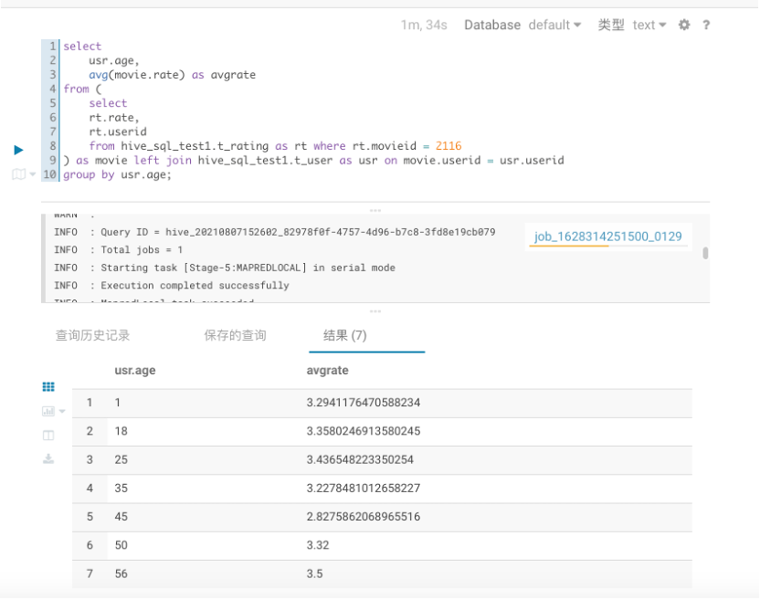
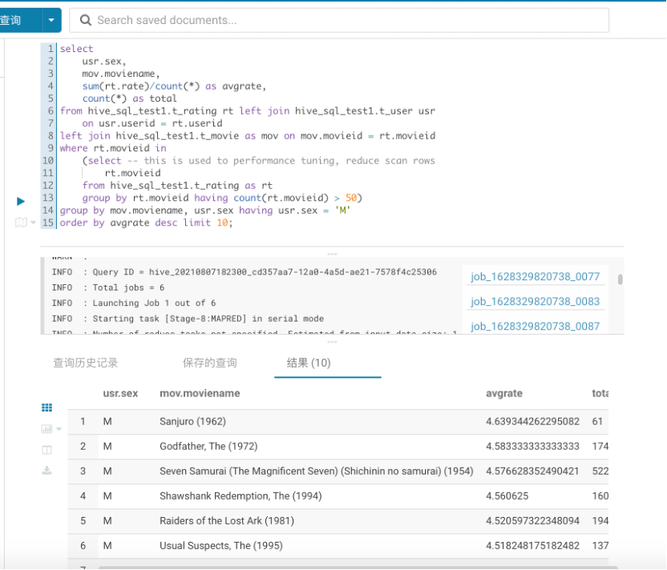

## 通过Hive SQL分析电影数据
> 在hive的hive_sql_test1库中共有3张表，对应数据量：t_user观众表6000+数据、t_movie表共3000+数据、t_rating表100万+条数据。

### 1. 展示电影id为{2116}这部电影各年龄段的平均影评分
```SQL
select
    usr.age,
    avg(movie.rate) as avgrate
from (
    select
    rt.rate,
    rt.userid
    from hive_sql_test1.t_rating as rt where rt.movieid = 2116
) as movie left join hive_sql_test1.t_user as usr on movie.userid = usr.userid
group by usr.age;
```
在`HUE`中的执行截图如下所示：


### 2. 找出男性评分最高且评分次数超过50次的10部电影，展示电影名、平均影评分和评分次数
```SQL
select
    usr.sex,
    mov.moviename,
    sum(rt.rate)/count(*) as avgrate,
    count(*) as total
from hive_sql_test1.t_rating rt left join hive_sql_test1.t_user usr
    on usr.userid = rt.userid
left join hive_sql_test1.t_movie as mov on mov.movieid = rt.movieid
where rt.movieid in
    (select -- this is used to performance tuning, reduce scan rows
        rt.movieid
    from hive_sql_test1.t_rating as rt
    group by rt.movieid having count(rt.movieid) > 50)
group by mov.moviename, usr.sex having usr.sex = 'M'
order by avgrate desc limit 10;
```
在`HUE`中的执行截图如下所示：

